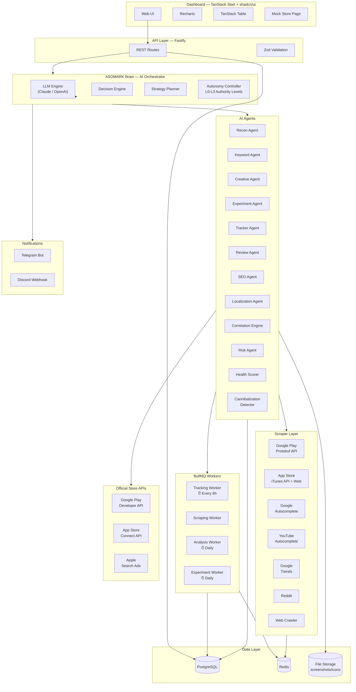
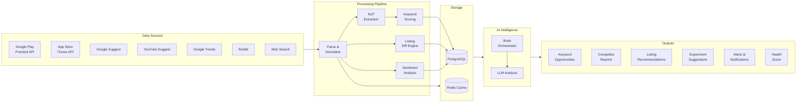
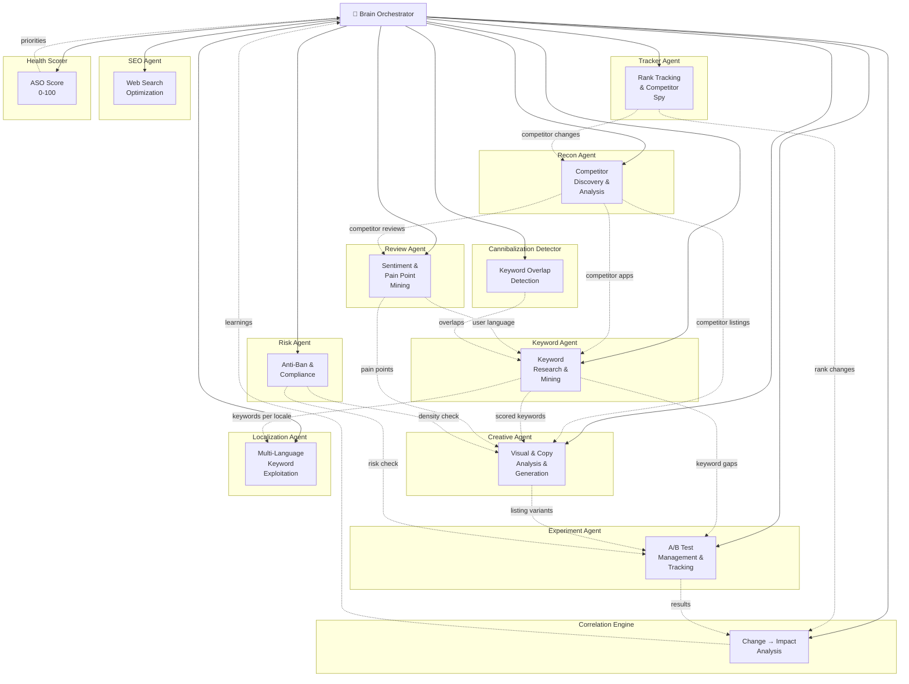
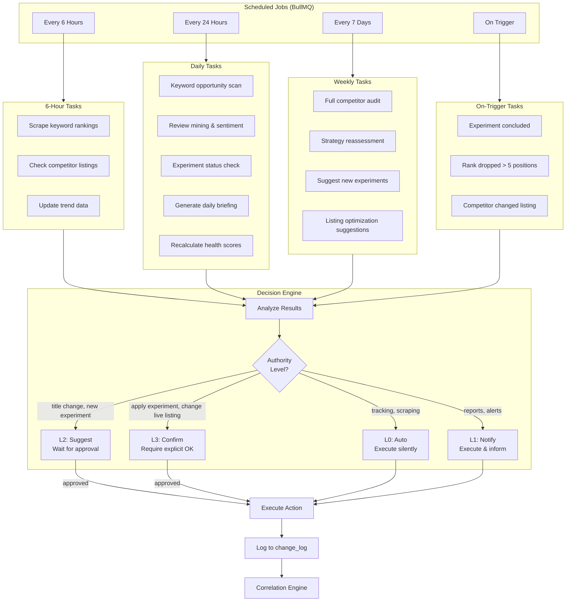
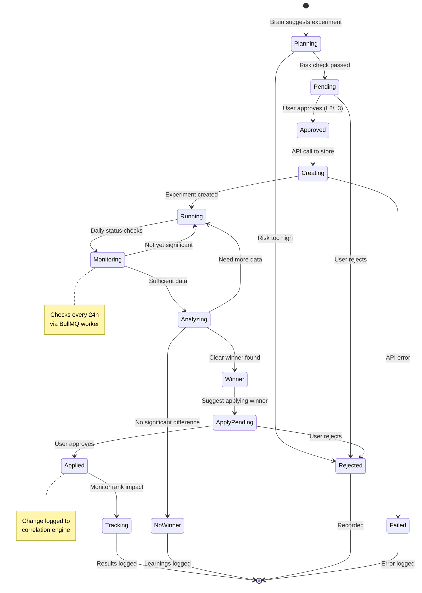
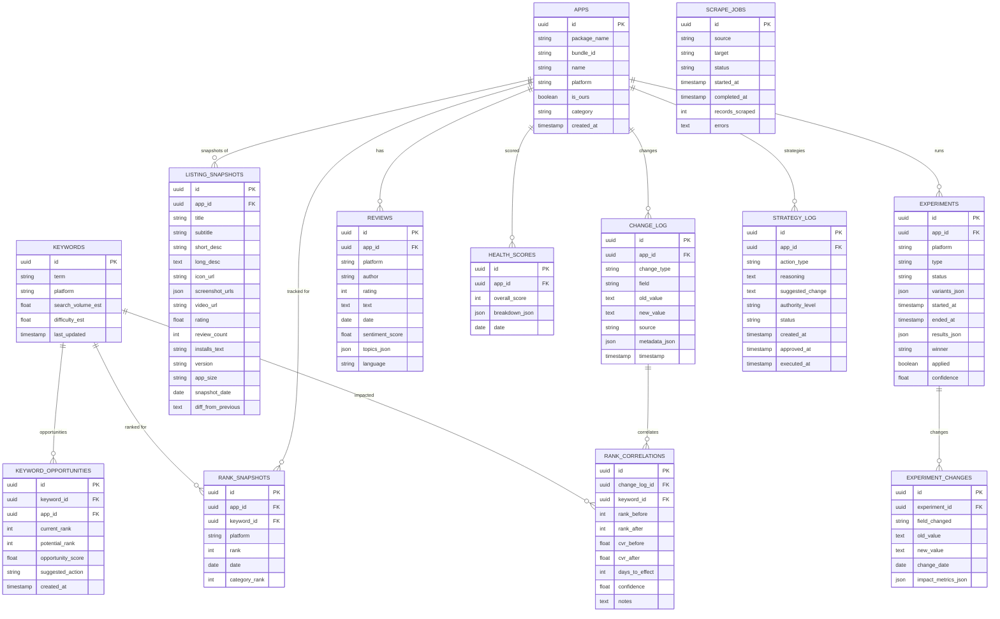
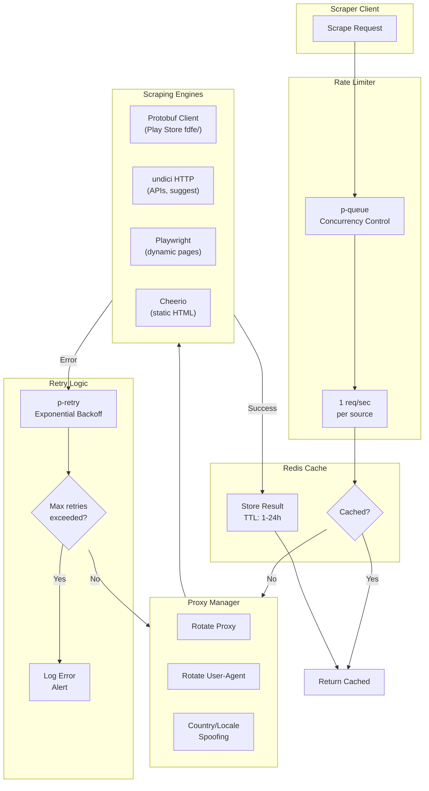
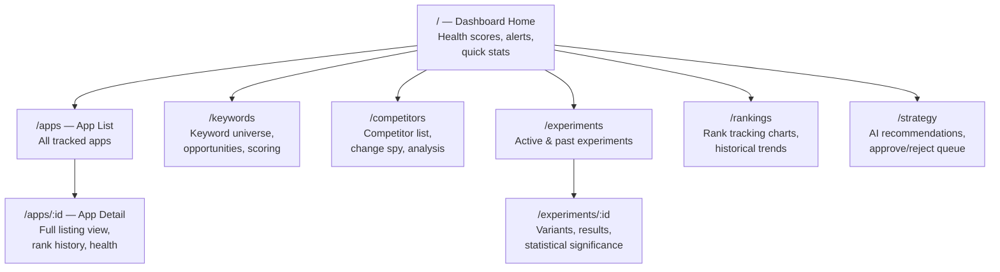
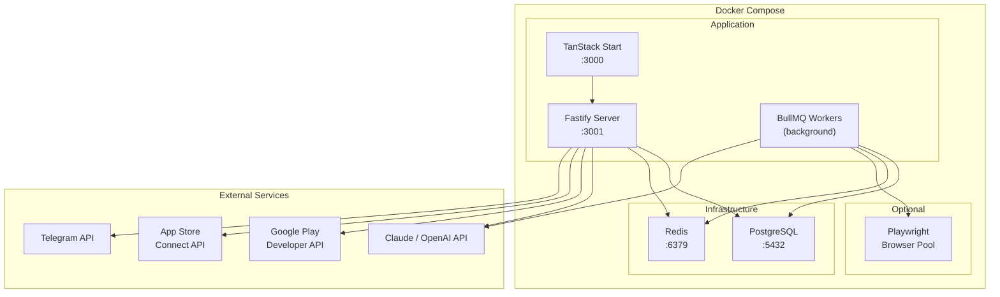

# ASOMARK — Architecture Diagrams

## 1. High-Level System Architecture

---

## 2. Data Flow — From Scraping to Strategy

---

## 3. Agent Interaction Map

---

## 4. Autonomous Loop — Scheduling & Decision Flow

---

## 5. Keyword Research Pipeline

```mermaid
flowchart LR
    subgraph Sources["15+ Data Sources"]
        S1["Play Store<br/>Autocomplete"]
        S2["iTunes<br/>Search API"]
        S3["Google<br/>Autocomplete"]
        S4["YouTube<br/>Autocomplete"]
        S5["Google<br/>Trends"]
        S6["Competitor<br/>Descriptions"]
        S7["Competitor<br/>Reviews"]
        S8["Reddit<br/>Discussions"]
        S9["Apple Search<br/>Ads"]
        S10["Category<br/>Top Apps"]
    end

    subgraph Mining["Mining Techniques"]
        Alpha["Alphabet Soup<br/>a→z, aa→zz"]
        Prefix["Category Prefix<br/>'best X app'"]
        NLP["NLP Entity<br/>Extraction"]
        NGram["N-gram<br/>Analysis"]
        CrossLang["Cross-Language<br/>Discovery"]
        Misspell["Misspelling<br/>Mining"]
    end

    subgraph Scoring["Scoring Engine"]
        Volume["Search Volume<br/>× 0.30"]
        Relevance["App Relevance<br/>× 0.25"]
        Difficulty["Difficulty⁻¹<br/>× 0.20"]
        Gap["Competitor Gap<br/>× 0.15"]
        Trend["Trend Momentum<br/>× 0.10"]
        Final["Final<br/>Score"]
    end

    subgraph Filters["Filters & Checks"]
        Cannibal["Cannibalization<br/>Check"]
        RiskCheck["Risk Check<br/>Density/Policy"]
        Overlap["Overlap<br/>Detection"]
    end

    subgraph Output["Output"]
        Title["Title Keywords<br/>50 chars Android<br/>30 chars iOS"]
        Subtitle["Subtitle Keywords<br/>80 chars Android<br/>30 chars iOS"]
        Desc["Description<br/>Keywords"]
        Backend["Backend Keywords<br/>100 chars iOS"]
        Locale["Per-Locale<br/>Keywords"]
        Opportunities["Keyword<br/>Opportunities<br/>Report"]
    end

    Sources --> Mining --> Scoring
    Volume --> Final
    Relevance --> Final
    Difficulty --> Final
    Gap --> Final
    Trend --> Final
    Final --> Filters --> Output
```

---

## 6. Experiment Lifecycle

---

## 7. Database Entity Relationship

---

## 8. Scraper Architecture — Request Flow

---

## 9. Dashboard Page Map

---

## 10. Deployment Architecture

